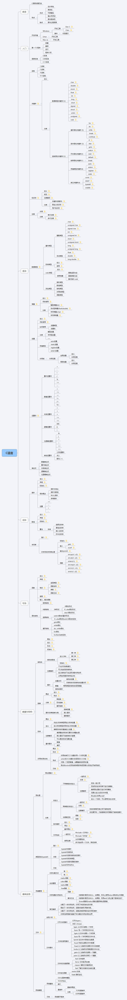

# C语言学习
# 第一章——前言
- [C语言发展历史]()
- [C语言特点]()
# 第二章——入门
- [开发环境]()
- [第一个C程序]()
- [语言标准]()
# 第三章——语法
- [进制]()
- [关键字]()
- [标识符]()
- [注释]()
- [数据类型]()
- [常量]()
- [变量]()
- [运算符]()
- [表达式]()
# 第四章——词法
- [指针]()
- [数组]()
- [字符串]()
# 第五章——句法
- [函数]()
- [语句结构]()
# 第六章——数据与结构
- [结构体]()
- [链表]()
- [枚举]()
- [共用体(联合体)]()
# 第七章——高级应用
- [预处理]()
- [类型别名(typedef)]()
- [存储管理]()
- [文件]()
- [网络编程]()
# 思维导图

